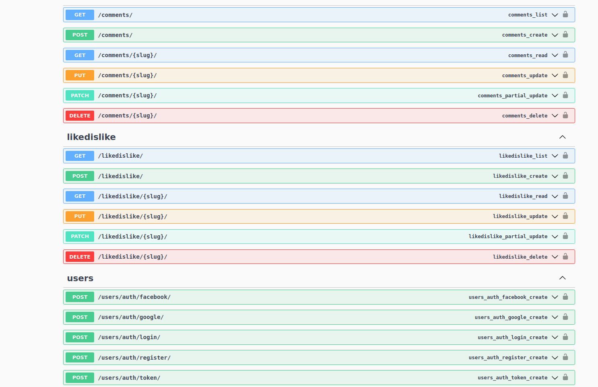
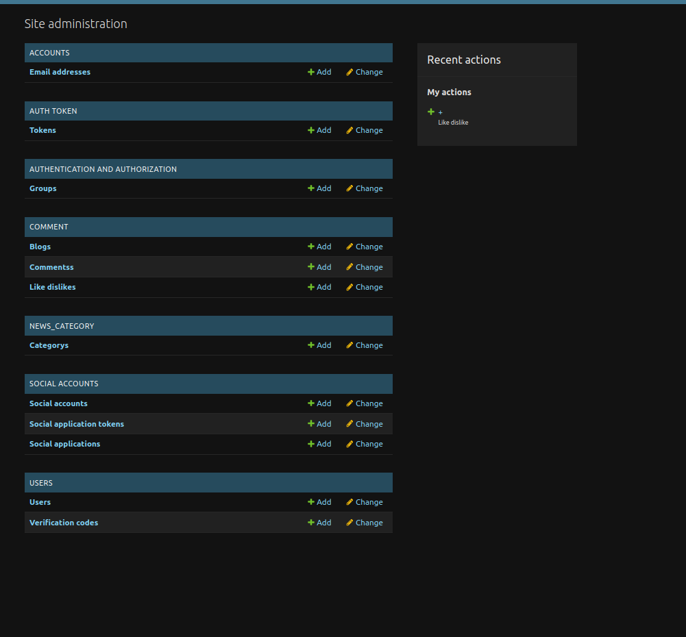

# ✅ Setup up backend app with django, postgresql and db models for news project
# ✅  Blogs, blogs category, author, ... CRUD
# ✅  Top blogs list API (last 20 blogs)
# ✅  Blogs List with category
# ✅  Filters, Searches, Orderings and Listings with paginations
# ✅  Like & dislike API
# ✅  Comments API
# ✅  JWT authorization (email or username, password)
# ✅  Google, Facebook authorization
# ✅  Testing
# ✅  Deployment

